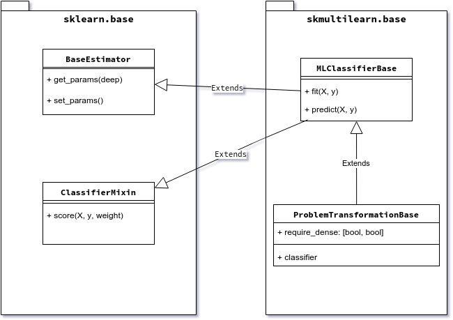

.. _implementing-classifier:
Implementing a multi-label classifier
=====================================

To implement a multi-label classifier you need to subclass a classifier base class, Currently you can select of a few classifier base classes depending on which approach to multi-label classification you follow. 

Scikit-multilearn inheritance tree for classiffier is shown on figure below.

To implement a scikit-learn's ecosystem compatible classifier we need to subclass two classes from sklearn.base: BaseEstimator and ClassifierMixin. For that we provide :class:`skmultilearn.base.MLClassifierBase` base class. We further extend this class with properties specific to the problem transformation approach in multi-label classification in :class:`skmultilearn.base.ProblemTransformationBase`.

Scikit-learn base classses
--------------------------

BaseEstimator
^^^^^^^^^^^^^

The base estimator class from scikit is responsible for providing the ability of cloning classifiers, for example when multiple instances of exactly the same classifier are needed for cross validation performed using the CrossValidation class.

The class provides two functions responsible for that: ``get_params``, which fetches parameters from a classifier object and ``set_params``, which sets params of the target clone. The params should also be acceptable by the constructor.

ClassifierMixin
^^^^^^^^^^^^^^^

This is an interface with a non-important method that allows different classes in scikit to detect that our classifier behaves as a classifier (i.e. implements ``fit``/``predict`` etc.) and provides certain kind of outputs.

MLClassifierBase
----------------

The base multi-label classifier in scikit-multilearn is :class:`skmultilearn.base.MLClassifierBase`. It provides two abstract methods: fit(X, y) to train the classifier and predict(X) to predict labels for a set of samplese. These functions are expected from every classifier. It also provides a default implementation of get_params/set_params that works for multi-label classifiers. 

Copyable fields
^^^^^^^^^^^^^^^

One of the most important concepts in scikit-learn's ``BaseEstimator``, is the concept of cloning. Scikit-learn provides a plethora of experiment performing methods, among others cross validation, which require the ability to clone a classifier. Scikit-multilearn's base multi-label class - ``MLClassifierBase`` - provides infrastructure for automatic cloning support. 

All you need to do in your classifier is: 

1. subclass ``MLClassifierBase`` or a derivative class
2. set self.copyable_attrs in your class's constructor to a list of fields (as strings), that should be cloned (usually it is equal to the list of constructor's arguments)

An example of this would be: 

.. code:: python

	class AssignKBestLabels(MLClassifierBase):
	    """Assigns k most probable labels"""

	    def __init__(self, k = None):
	        super(AssignKBestLabels, self).__init__()
	        self.k = k
	        self.copyable_attrs = ['k']

The fit method
^^^^^^^^^^^^^^

The ``fit(self, X, y)`` expects classifier training data:

- ``X`` should be a sparse matrix of shape: ``(n_samples, n_features)``, although for compatibility reasons array of arrays and a dense matrix are supported. 

- ``y`` should be a sparse, binary indicator, matrix of shape: ``(n_samples, n_labels)`` with 1 in a position ``i,j`` when ``i``-th sample  is labeled with label no. ``j``

It should return ``self`` after the classifier has been fitted to training data. It is customary that ``fit`` should remember ``n_labels`` in a way. In practice we store ``n_labels`` as ``self.label_count`` in scikit-multilearn classifiers.

The predict method
^^^^^^^^^^^^^^^^^^

The ``predict(self, X)`` returns a prediction of labels for the samples from ``X``:

- ``X`` should be a sparse matrix of shape: ``(n_samples, n_features)``, although for compatibility reasons array of arrays and a dense matrix are supported. 

The returned value is similar to ``y`` in ``fit``. It should be a sparse binary indicator matrix of the shape ``(n_samples, n_labels)``.

In some cases, while scikit continues to progress towards complete switch to sparse matrices, it might be needed to convert the sparse matrix to a `dense matrix` or even `array-like of array-likes`. Such is the case for some scoring functions in scikit. This problem should go away in the future versions of scikit.

Selecting the base class
------------------------

Madjarov et al. divide approaches to multi-label classification into three categories, you should select a scikit-multilearn base class according to the philosophy behind your classifier: 

- algorithm adaptation, when a single-label algorithm is directly adapted to multi-label case, ex. Decision Trees can be adapted by taking multiple labels into consideration in decision functions, for now the base function for this approach is ``MLClassifierBase``

- problem transformation, when the multi-label problem is transformed to a set of single-label problems, solved there and converted to a multi-label solution afterwards - for this approach we provide a comfortable ``ProblemTransformationBase`` base class

- ensemble classification, when multi-label classification is performed by an ensemble of multi-label classifiers to improve performance, overcome overfitting etc. - there are a couple of ensemble classifiers that can server as base classes, see below

Problem transformation
^^^^^^^^^^^^^^^^^^^^^^

Problem transformation approach is centered around the idea of converting a multi-label problem into one or more single-label problems, which are usually solved by single- or multi-class classifiers. Scikit-learn is the de facto standard source of Python implementations of single-label classifiers. 

In order to perform the transformation, every problem transformation classifier needs a base classifier. As all classifiers that follow scikit-s BaseEstimator a clonable, scikit-multilearn's base class for problem transformation classifiers requires an instance of a base classifier in initialization. Such an instance can be cloned if needed, and its parameters can be set up comfortably. 

The biggest problem with joining single-label scikit classifiers with multi-label classifiers is that there exists no way to learn whether a given scikit classifier accepts sparse matrices as input for ``fit``/``predict`` functions. For this reason ``ProblemTransformationBase`` requires another parameter - ``require_dense`` : ``[ bool, bool ]`` - a list/tuple of two boolean values. If the first one is true, that means the base classifier expects a dense (scikit-compatible array-like of array-likes) representation of the sample feature space ``X``. If the second one is true - the target space ``y`` is passed to the base classifier as an array like of numbers. In case any of these are false - the arguments are passed as a sparse matrix.

If the ``required_dense`` argument is not passed, it is set to ``[false, false]`` if a classifier inherits ::class::``MLClassifierBase`` and to ``[true, true]`` as a fallback otherwise. In short it assumes dense representation is required for base classifier if the base classifier is not a scikit-multilearn classifier. 

Ensemble classification
^^^^^^^^^^^^^^^^^^^^^^^

Ensemble classification is an approach of transforming a multi-label classification problem into a family (an ensemble) of multi-label subproblems. 

In the case when your classifier concentrates on clustering the label space you should look into existing clustering schemes in the skmultilearn.ensemble module as base classes. In most cases you can take an existing general scheme, such as: :class:`LabelSpacePartitioningClassifier` - which partitions a label space using a clusterer class that implements the :class:`LabelSpaceClustererBase` interface. 

Unit testing
------------

Scikit-multilearn provides a base unit test class for testing classifiers. Please check ``skmultilearn.tests.classifier_basetest`` for a general framework for testing the multi-label classifier.

Currently tests test three capabilities of the classifier:
- whether the classifier works with dense/sparse input data :func:`ClassifierBaseTest.assertClassifierWorksWithSparsity`
- whether it is clonable and works with scikit-learn's cross-validation classes :func:`ClassifierBaseTest.assertClassifierWorksWithCV`

Implement your classifier checklist
-----------------------------------

- fork the scikit-multilearn repo
- choose a base classifier class
- implement constructor and set self.copyable_attrs
- implement fit 
- implement predict
- write unit tests
- create a pull-request
- receive thanks from the team and bathe in glory
