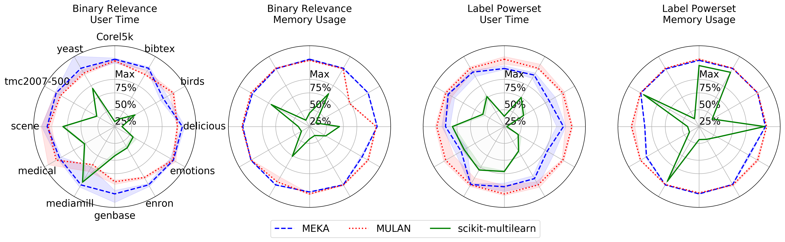

scikit-multilearn benchmark
---------------------------

Scikit-multilearn is faster than MEKA, MULAN on 12 well-cited benchmark multi-label classification datasets in two comparison scenarios:

- Binary Relevance: one single-class classifier trained per label
- Label Powerset: one multi-class classifier trained per data set, each class corresponds to a unique label combination.

We use these methods to illustrate two aspects of the classification performance of the libraries:

- the cost of using many classifiers with splitting operations performed on the label space matrix
- the cost of using a single classifier which requires to access all label combinations to perform the transformation.

Both classification schemes scikit-multilearn always use less or, in a few edge cases the same amount of, memory than MEKA or MULAN due to its sparse matrix support.

In most cases scikit-multilearn also operates faster than MEKA or MULAN, apart from the edge case of Binary Relevance classification of the mediamill data set.

  Normalized (100\% - worst median) user running time (s) and memory usage of scikit-multilearn, Meka and Mulan implementations for Binary Relevance and Label Powerset multi-label classifiers based on Random Forest.  The closer the library is to point 0, the better it performed, thus the smaller area inside the library curve, the better.

The Figure presents the time and memory required to perform classification, including loading the ARFF data set and measuring errors, i.e. a complete classification use case scenario.

As different data sets require different amount of time and memory we decided to normalize the charts. The results on the chart are normalized for each data set separately.

Normalizion is calculated as follows: out of the median of every library's time or memory perfomance the highest of the medians in the data is used as normalization point, i.e. 100% is the worst median performance.

We present the best, median, and worst performance of each library per data set, normalized performance with the worst median performance on that data set.

All the libraries were forced to use a single core using the ``taskset`` command to minimize parallelization effects on the comparison. Time and memory results were obtained using the ``time -v`` command and represent User time, and Maximum resident set size respectively. All results taken into consideration reported that 100% of their CPU core had been assigned to the process which performed the classification scenario.

We did not test algorithm adaptation methods as there are no algorithm adaptation methods present in all three libraries.

To minimize the impact of base classifiers, we have decided to use a fast Random Forest base classifier with 10 trees.

We have checked the classification quality and did not find significant differences between Hamming Loss, Jaccard and Accuracy scores between the outputs.
